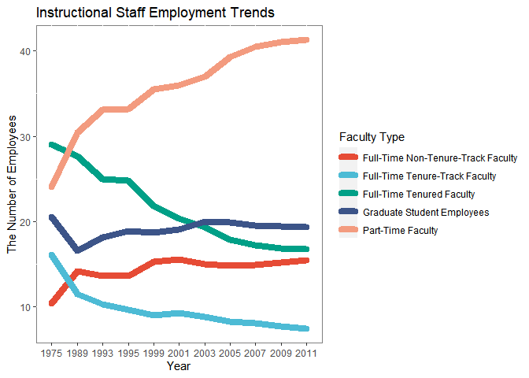
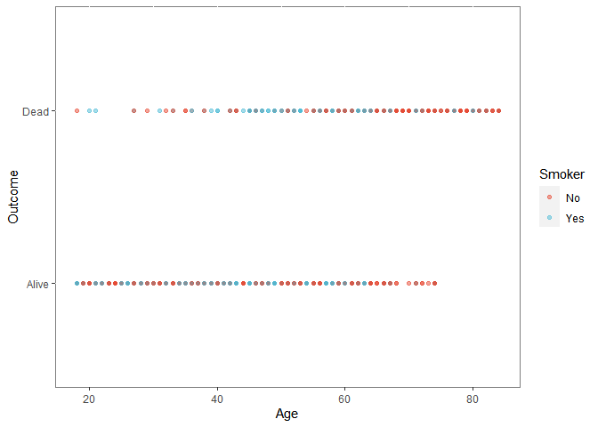
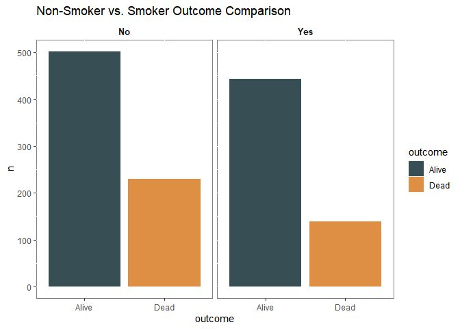
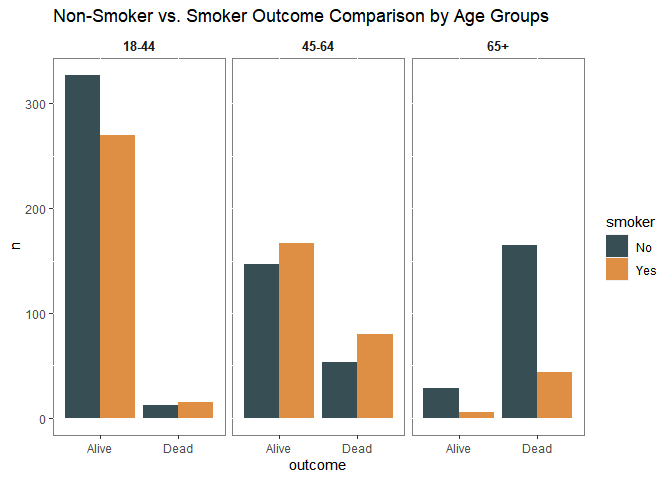

Lab 06 - Ugly charts and Simpson’s paradox
================
Colin Li
2/14/2023

### Load packages and data

``` r
library(tidyverse) 
library(dsbox)
library(mosaicData) 
library(ggplot2)
library(ggsci)
staff <- read_csv("data/instructional-staff.csv")

staff
```

    ## # A tibble: 5 × 12
    ##   facult…¹ `1975` `1989` `1993` `1995` `1999` `2001` `2003` `2005` `2007` `2009`
    ##   <chr>     <dbl>  <dbl>  <dbl>  <dbl>  <dbl>  <dbl>  <dbl>  <dbl>  <dbl>  <dbl>
    ## 1 Full-Ti…   29     27.6   25     24.8   21.8   20.3   19.3   17.8   17.2   16.8
    ## 2 Full-Ti…   16.1   11.4   10.2    9.6    8.9    9.2    8.8    8.2    8      7.6
    ## 3 Full-Ti…   10.3   14.1   13.6   13.6   15.2   15.5   15     14.8   14.9   15.1
    ## 4 Part-Ti…   24     30.4   33.1   33.2   35.5   36     37     39.3   40.5   41.1
    ## 5 Graduat…   20.5   16.5   18.1   18.8   18.7   19     20     19.9   19.5   19.4
    ## # … with 1 more variable: `2011` <dbl>, and abbreviated variable name
    ## #   ¹​faculty_type

### Faculty

If there are 5 faculty types and 11 years of data, how many rows would
we have? 55 rows

What changes would you propose making to this plot to tell this story?

``` r
staff_long <- staff %>%
  pivot_longer(cols = -faculty_type, names_to = "year") %>%
  mutate(value = as.numeric(value))

staff_long
```

    ## # A tibble: 55 × 3
    ##    faculty_type              year  value
    ##    <chr>                     <chr> <dbl>
    ##  1 Full-Time Tenured Faculty 1975   29  
    ##  2 Full-Time Tenured Faculty 1989   27.6
    ##  3 Full-Time Tenured Faculty 1993   25  
    ##  4 Full-Time Tenured Faculty 1995   24.8
    ##  5 Full-Time Tenured Faculty 1999   21.8
    ##  6 Full-Time Tenured Faculty 2001   20.3
    ##  7 Full-Time Tenured Faculty 2003   19.3
    ##  8 Full-Time Tenured Faculty 2005   17.8
    ##  9 Full-Time Tenured Faculty 2007   17.2
    ## 10 Full-Time Tenured Faculty 2009   16.8
    ## # … with 45 more rows

``` r
staff_long %>%
  ggplot(aes(x = year,
             y = value,
             group = faculty_type,
             color = faculty_type)) +
  geom_line(linewidth = 3, lineend = "round") + scale_color_npg() + labs(title ="Instructional Staff Employment Trends", x = "Year", y = "The Number of Employees", color="Faculty Type") + theme(panel.background = element_rect(fill = "white", colour = "grey50"))
```

<!-- -->

### Fisheries

``` r
fisheries <- read_csv("data/fisheries.csv")
```

    ## Rows: 216 Columns: 4
    ## ── Column specification ────────────────────────────────────────────────────────
    ## Delimiter: ","
    ## chr (1): country
    ## dbl (3): capture, aquaculture, total
    ## 
    ## ℹ Use `spec()` to retrieve the full column specification for this data.
    ## ℹ Specify the column types or set `show_col_types = FALSE` to quiet this message.

### Smokers in Whickham

What type of study do you think these data come from: observational or
experiment? Why? observational, we can’t manipulate whether people to be
smokers or not

How many observations are in this dataset? What does each observation
represent? 1314 obeservations, each observation is a person

How many variables are in this dataset? What type of variable is each?
Display each variable using an appropriate visualization. 3 variables,
outcome (dichotomous), smoker (dichotomous), and age (continuous)

What would you expect the relationship between smoking status and health
outcome to be? Positive correlation, smokers die early

``` r
data(Whickham)


ggplot(data = Whickham, 
       mapping = aes(x = age, 
                     y = outcome, color=smoker)) +
  xlab("Age") + 
  ylab("Outcome") + 
  geom_point() +
  scale_color_npg(alpha = 0.5)+ theme(panel.background = element_rect(fill = "white", colour = "grey50")) + labs(color = "Smoker")
```

<!-- -->

``` r
Smoke <- Whickham %>%
  count(smoker, outcome)


#I tried a couple of ways to use functions to calculate the percentages and did not work :(, so I did it by hand

smoker_death_rate <- 139/(443+139) *100
nonsmoker_death_rate <- 230/(502+230) *100

smoker_death_rate
```

    ## [1] 23.88316

``` r
nonsmoker_death_rate 
```

    ## [1] 31.42077

``` r
ggplot(Smoke, mapping = aes(y = n, x = outcome, fill = outcome))  + facet_wrap(~ smoker) + geom_col() + theme(panel.background = element_rect(fill = "white", colour = "grey50")) + scale_fill_jama() + ggtitle("Non-Smoker vs. Smoker Outcome Comparison") + theme(strip.background = element_rect(fill="white"), strip.text = element_text(size = 10, face = "bold"))
```

<!-- -->

``` r
age_groups <- cut(Whickham$age, breaks = c(17, 44, 64, Inf), labels = c("18-44", "45-64", "65+"))


Whickham1 <- Whickham %>%
  mutate(age_cat = age_groups)

sm <- Whickham1 %>%
  count(smoker, age_cat, outcome)

ggplot(sm, mapping = aes(y = n, x = outcome, fill = smoker))  + facet_wrap(~ age_cat) + geom_col(position = "dodge") + theme(panel.background = element_rect(fill = "white", colour = "grey50")) + scale_fill_jama() + ggtitle("Non-Smoker vs. Smoker Outcome Comparison by Age Groups") + theme(strip.background = element_rect(fill="white"), strip.text = element_text(size = 10, face = "bold"))
```

<!-- --> It looks like
smokers are more likely to die in 18-44 & 45-64 age groups, but not the
case for the 65+ age group. For 65+ people, nonsmokers died a lot more
than smokers, which explains why we saw nonsmokers have a higher death
rate than smokers in the previous graph. Because this is not an
experiment, many reasons can cause 65+ nonsmokers to die e.g., aging,
comorbidities. This also speaks to the importance of analyzing data by
groups.

…

Add exercise headings as needed.
